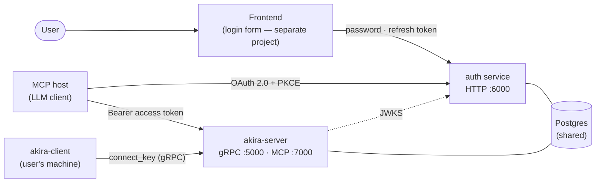
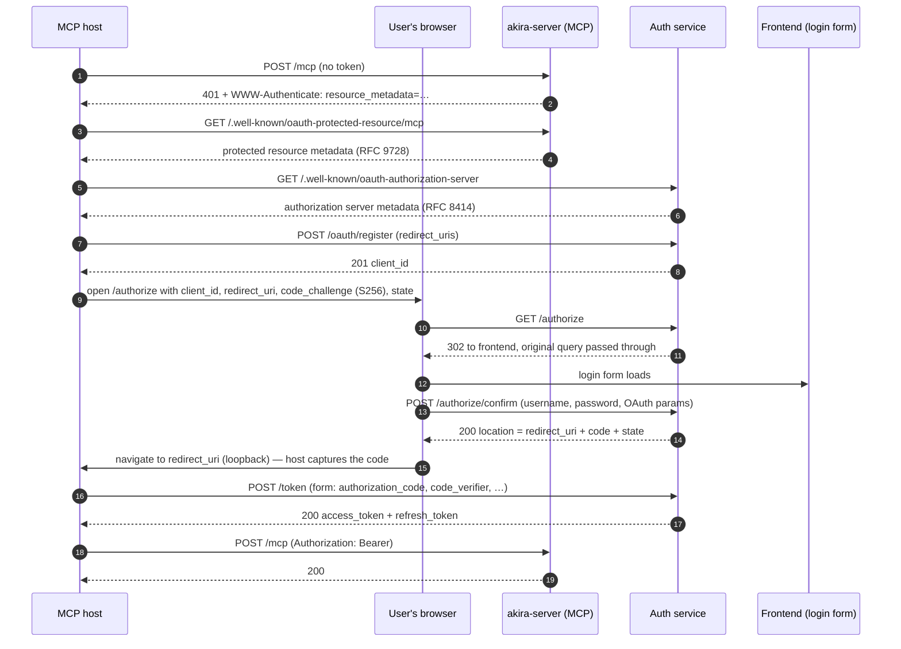

# Auth flow

How authentication and authorization work across Akira: users register and verify their
email with the auth service, the frontend and MCP hosts hold access/refresh token pairs,
and machines connect through a per-user `connect_key`. This document covers the whole
lifecycle end to end — registration, the token model, the OAuth 2.0 authorization-code +
PKCE flow that MCP clients drive, and the machine connection path — as implemented in
`internal/auth` and `internal/akira-server/mcp`.

## Contents

1. [Overview](#1-overview)
2. [Registration and email verification](#2-registration-and-email-verification)
3. [Token model](#3-token-model)
4. [Session lifecycle (frontend API)](#4-session-lifecycle-frontend-api)
5. [OAuth for MCP clients (authorization code + PKCE)](#5-oauth-for-mcp-clients-authorization-code--pkce)
6. [Token validation on the MCP side](#6-token-validation-on-the-mcp-side)
7. [Machine connection (connect_key)](#7-machine-connection-connect_key)
8. [Data model](#8-data-model)
9. [Configuration](#9-configuration)
10. [Security properties and known limitations](#10-security-properties-and-known-limitations)
11. [Appendix: driving the flow with curl](#11-appendix-driving-the-flow-with-curl)

## 1. Overview



Four kinds of credentials, four holders:

| Credential | Held by | Obtained from | Used for |
|---|---|---|---|
| password | the user | chosen at registration | login (`/token` password grant, `/authorize/confirm`) |
| access JWT (RS256, 15 min) | frontend, MCP host | `/verify`, `/token` (any grant) | `Authorization: Bearer` on `/me`, `/mcp` |
| refresh token (opaque, 30 days) | frontend, MCP host | issued alongside every access token | single-use rotation at `/token` |
| `connect_key` (10 chars) | the user, copied onto each machine | email verification, `/connect-key/regenerate` | `akira-client` gRPC registration |
| OAuth `client_id` (26 chars) | MCP host | `POST /oauth/register` (dynamic registration) | the authorization-code flow |

Design points that shape everything below:

- **One shared Postgres** backs both services. akira-server resolves `connect_key → user`
  directly in the DB (`cmd/akira-server` wraps the store in `storeLookup`); there is no
  network hop from akira-server to auth on the machine-connection path.
- **Token validation is autonomous.** Consumers (akira-server's MCP layer, and anything
  else) verify access JWTs against auth's published JWKS — auth is not on the per-request
  path. The flip side: signing keys live **in memory only**, so an auth restart generates
  a new `kid` and invalidates every previously issued access token; consumers re-fetch the
  JWKS when they see an unknown `kid`.
- **All services listen on plaintext HTTP** (`:5000` gRPC, `:6000` auth, `:7000` MCP).
  TLS termination and rate limiting are expected at a front reverse proxy (nginx) — see
  [§10](#10-security-properties-and-known-limitations).

## 2. Registration and email verification

```mermaid
sequenceDiagram
    autonumber
    participant F as Frontend
    participant A as Auth service
    participant M as Mail (SMTP or log)
    participant DB as Postgres

    F->>A: POST /register (username, email, password)
    A->>DB: CreateUserWithCode — user + first code, one transaction
    A->>M: SendCode(email, 6-digit code, TTL)
    A-->>F: 201 pending_verification

    F->>A: POST /verify (email, code)
    A->>DB: CompleteEmailVerification — consume code + mark verified + assign connect_key, one transaction
    A-->>F: 200 access_token + refresh_token
    Note over F,A: No separate login after verification; connect_key is fetched later via GET /me
```

**`POST /register`** — `{username, email, password}` → `201 {"status":"pending_verification"}`.

Validation: username non-empty; email non-empty and contains `@`; password 8–72 bytes
(72 is the bcrypt limit — longer is rejected with a clear error instead of being silently
truncated). Failures: `400 invalid_request`, `409 user_exists` / `email_exists`, `500
server_error`. The user record and the first verification code are created in one
transaction (`CreateUserWithCode`) — a crash cannot leave a user without a code.

**The verification code** is 6 digits drawn uniformly from `crypto/rand`, stored only as
a sha256 hash, valid for `AUTH_EMAIL_TTL` (default 15m), with at most **5 wrong attempts**
per code. There is one active code per user, keyed by `user_id` — two users can
legitimately hold the same 6-digit value; lookups are per-user, so that is not a
conflict.

Mail delivery: SMTP when `SMTP_HOST` is set; otherwise the code is written to the auth
service log (local dev mode).

**`POST /verify`** — `{email, code}` → marks the email verified, assigns the
`connect_key`, and **immediately returns an access + refresh token pair** — the user does
not log in again after verifying. All three state changes (consume code, mark verified,
assign key) happen atomically in `CompleteEmailVerification`; a connect_key collision is
checked *before* the code is consumed, so a collision does not burn the code.

Every failure — unknown email, wrong code, expired code, exhausted attempts, already-used
code — returns the same `401 invalid_code` (anti-enumeration: the response does not
reveal whether the address is registered).

**`POST /verify/resend`** — `{email}` → `200 {"status":"pending_verification"}`. For a
known, unverified address: the mail is sent **before** the new code is saved, so an SMTP
failure leaves the previous code valid; the new code then replaces the old one and resets
the attempt counter. For an unknown or already-verified address: the same 200, without
sending mail (anti-enumeration).

## 3. Token model

**Access token — JWT (RS256).**

- RSA-2048 keypair generated at startup, random `kid` per run. Keys are never persisted:
  after a restart the `kid` changes and all previously issued access tokens become
  invalid. Consumers must re-fetch the JWKS on unknown `kid` (the MCP validator does).
- Claims:

```json
{
  "iss": "akira",
  "sub": "<random hex user_id>",
  "jti": "<random hex>",
  "iat": 1757400000,
  "exp": 1757400900,
  "typ": "access"
}
```

- Lifetime `AUTH_ACCESS_TTL`, default 15 minutes.

**Refresh token — opaque.** 32 random bytes, base64url-encoded (43 chars) and shown to
the client exactly once; only its sha256 hash is stored. Lifetime `AUTH_REFRESH_TTL`,
default 720h (30 days). Single-use: every refresh **rotates** — the old hash is consumed
and the replacement persisted in one atomic store operation (`RotateRefresh`), and the
response is sent only after the replacement is durable. A replayed or expired token
fails with `401 invalid_grant`.

**JWKS.** `GET /jwks.json` (also `/.well-known/jwks.json`), `Cache-Control: public,
max-age=60`:

```json
{"keys":[{"kty":"RSA","kid":"…","alg":"RS256","use":"sig","n":"…","e":"AQAB"}]}
```

**Common response shapes.** Every token-issuing endpoint returns:

```json
{"access_token":"…","token_type":"Bearer","expires_in":900,"refresh_token":"…"}
```

Errors everywhere use the OAuth shape `{"error":"<code>","error_description":"…"}`.
Request bodies are capped at 1 MiB (`http.MaxBytesReader`): over → `413`, malformed →
`400`.

## 4. Session lifecycle (frontend API)

**Login — `POST /token`** with `grant_type=password` (`{username, password}`, JSON —
form-encoded is accepted too):

- Missing fields → `400 invalid_request`.
- Credential check (`checkCredentials`, shared with `/authorize/confirm`): unknown
  username, wrong password, and unverified email all produce the same `401
  invalid_grant` — and for an unknown username a bcrypt comparison against a dummy hash
  is still performed, so response timing does not reveal whether the account exists.
- A store failure is **not** folded into the 401 — it is a distinct `500 server_error`
  (outages stay visible to clients and monitoring).

**Refresh — `POST /token`** with `grant_type=refresh_token`: atomic rotation as
described in [§3](#3-token-model). Unknown/expired/replayed → `401 invalid_grant`; store
failure → `500` with the old token still valid.

**Revoke — `POST /revoke`** `{refresh_token}` → `204`, idempotent. Access tokens cannot
be revoked — their 15-minute TTL is the mitigation; revocation kills the refresh chain.

**Account — `GET /me`** (Bearer access token):

```json
{"user_id":"…","username":"…","email":"…","verified":true,"connect_key":"…"}
```

`401 invalid_token` for a missing/bad token or a deleted user.

**`POST /connect-key/regenerate`** (Bearer) → `{"connect_key":"…"}`. The key is checked
only at connection time, so machines connected with the old key keep working until they
disconnect; they will not be able to reconnect until updated.

## 5. OAuth for MCP clients (authorization code + PKCE)

MCP hosts (Claude, IDEs, anything speaking MCP) are **public clients**: they cannot keep
a client secret, so they authenticate to `/token` with `client_id` + PKCE only. The flow
below is the standard MCP authorization bootstrap, and it is what mcp-go's client runs
automatically — an end user pastes the MCP URL, gets redirected to the login form once,
and the host stores the resulting tokens.

The same access/refresh token pair comes out of this flow as out of the password grant —
one token system across the whole project.



Step by step:

1. **The 401 that starts it all.** An unauthenticated call to `POST /mcp` gets:

   ```
   HTTP/1.1 401 Unauthorized
   WWW-Authenticate: Bearer realm="akira", resource_metadata="<MCP_PUBLIC_URL>/.well-known/oauth-protected-resource/mcp"
   ```

2. **Protected resource metadata (RFC 9728)** — public, no auth, served by akira-server
   at `/.well-known/oauth-protected-resource/mcp`:

   ```json
   {
     "resource": "<MCP_PUBLIC_URL>/mcp",
     "authorization_servers": ["<MCP_AUTH_SERVER_URL>"],
     "bearer_methods_supported": ["header"]
   }
   ```

3. **Authorization server metadata (RFC 8414)** — `GET
   /.well-known/oauth-authorization-server` on auth. All URLs are absolute, built from
   `AUTH_PUBLIC_URL`:

   ```json
   {
     "issuer": "<AUTH_PUBLIC_URL>",
     "authorization_endpoint": "<AUTH_PUBLIC_URL>/authorize",
     "token_endpoint": "<AUTH_PUBLIC_URL>/token",
     "registration_endpoint": "<AUTH_PUBLIC_URL>/oauth/register",
     "revocation_endpoint": "<AUTH_PUBLIC_URL>/revoke",
     "jwks_uri": "<AUTH_PUBLIC_URL>/jwks.json",
     "response_types_supported": ["code"],
     "grant_types_supported": ["authorization_code", "refresh_token", "password"],
     "token_endpoint_auth_methods_supported": ["none"],
     "code_challenge_methods_supported": ["S256"],
     "scopes_supported": []
   }
   ```

4. **Dynamic client registration (RFC 7591)** — `POST /oauth/register`:

   ```json
   {"client_name":"my mcp host","redirect_uris":["http://127.0.0.1:1234/callback"],"token_endpoint_auth_method":"none"}
   ```

   Public clients only: `token_endpoint_auth_method` must be `none` (or absent), there is
   no secret. `redirect_uris` must be https, or http on localhost/127.0.0.1/::1 (a code
   must never travel over an open channel). Extra fields (`scope`, `resource`, …) are
   accepted and ignored. → `201`:

   ```json
   {"client_id":"…","client_name":"…","redirect_uris":["…"],"grant_types":["authorization_code","refresh_token"],"response_types":["code"],"token_endpoint_auth_method":"none"}
   ```

   `client_id` is 26 chars from the same 31-char alphabet as `connect_key`.

5. **`GET /authorize`** with `response_type=code`, `client_id`, `redirect_uri`, `scope`,
   `state`, `code_challenge`, `code_challenge_method`. Validation: the client must exist;
   `redirect_uri` must **exactly** match one of the registered URIs (no open redirects);
   PKCE is mandatory — `code_challenge` 43–128 chars, method `S256` only (`plain` is
   rejected). On success the request is **302-redirected to `AUTH_FRONTEND_URL`** with
   the original query passed through — the login form is a separate project, auth serves
   JSON only. With `AUTH_FRONTEND_URL` empty, `/authorize` answers a `503` JSON error
   instead, and the flow can be driven manually via `/authorize/confirm` (see the
   [appendix](#11-appendix-driving-the-flow-with-curl)).

6. **`POST /authorize/confirm`** — what the frontend sends after the user submits the
   login form: `{username, password}` plus all the OAuth parameters it received, verbatim:

   ```json
   {"username":"alice","password":"…","response_type":"code","client_id":"…","redirect_uri":"…","scope":"","state":"…","code_challenge":"…","code_challenge_method":"S256"}
   ```

   Credentials are checked (same anti-enumeration `checkCredentials` as the password
   grant: unknown user / wrong password / unverified → identical `401 invalid_grant`),
   the OAuth parameters are validated exactly as in `/authorize`, and a one-time
   authorization code is issued: 32 random bytes (hex), stored sha256-hashed, valid
   `AUTH_CODE_TTL` (default 10m). The response is **not** a redirect — it is the URL for
   the frontend to navigate to:

   ```json
   {"location":"<redirect_uri>?code=…&state=…"}
   ```

7. **`POST /token`** — form-encoded (per RFC 6749; JSON is also accepted):
   `grant_type=authorization_code`, `code`, `client_id`, `redirect_uri`,
   `code_verifier` (the `resource` parameter from RFC 8707 is accepted and ignored).
   Checks: the code is consumed atomically (`ConsumeOAuthCode` — concurrent exchanges of
   one code: exactly one wins, the rest get `invalid_grant`); `client_id` and
   `redirect_uri` must match the code record; PKCE S256 must hold:
   `base64url(sha256(code_verifier)) == code_challenge`. On success — the token pair.

Failure modes, all deliberately coarse:

| Step | Failure | Response |
|---|---|---|
| `/oauth/register` | no `redirect_uris` / non-https non-localhost URI / auth method ≠ none | `400 invalid_client_metadata` |
| `/authorize` | `response_type` ≠ code | `400 unsupported_response_type` |
| `/authorize` | unknown `client_id` | `400 invalid_client` |
| `/authorize` | `redirect_uri` not registered (exact match required) | `400 invalid_request` |
| `/authorize` | `code_challenge` missing / outside 43–128 / method ≠ S256 | `400 invalid_request` |
| `/authorize/confirm` | wrong password / unknown user / unverified email | `401 invalid_grant` |
| `/token` | unknown, expired or replayed code | `401 invalid_grant` |
| `/token` | `client_id`/`redirect_uri` ≠ code record | `401 invalid_grant` |
| `/token` | wrong `code_verifier` | `401 invalid_grant` |
| `/token` | unsupported `grant_type` | `400 unsupported_grant_type` |

## 6. Token validation on the MCP side

akira-server's MCP layer validates Bearer tokens the same way an external consumer
would (`internal/akira-server/mcp/auth.go`):

- The token is parsed with the **cached JWKS** (`kid` required in the signature), issuer
  checked against `MCP_AUTH_ISSUER` (must equal auth's `AUTH_ISSUER`), `exp`/`iat`
  validated, claim `typ` must be `access`, and `sub` (the user_id) must be non-empty.
- The JWKS cache is **lazy**: auth being down when akira-server starts is not fatal —
  the set is fetched when the first token arrives.
- An **unknown `kid`** (auth restarted, keys are in-memory) triggers a re-fetch of the
  JWKS, rate-limited to once per 30 s — a flood of tokens with crafted kids cannot DoS
  auth through the validator.
- On failure: `401` with the `WWW-Authenticate` header from step 1 of [§5](#5-oauth-for-mcp-clients-authorization-code--pkce),
  body kept minimal (`unauthorized`).
- On success: the user_id from `sub` goes into the request context, and **every** tool
  and resource call is scoped to connections whose `connection_id` starts with
  `{user_id}:` — one user can never see or touch another user's machines. A `client_id`
  containing `:` is rejected outright (it would forge a foreign `connection_id`).

## 7. Machine connection (connect_key)

```mermaid
sequenceDiagram
    autonumber
    participant C as akira-client
    participant S as akira-server (gRPC)
    participant DB as Postgres

    C->>S: Connect (RegisterRequest: client_id, connect_key, hostname, platform)
    S->>DB: lookup user by connect_key
    DB-->>S: user_id, verified
    S->>S: pool.Register (connection_id = user_id + ":" + client_id)
    S-->>C: RegisterResponse (session_id, heartbeat_interval_ms=30000, connection_id)
    Note over S,C: server→client stream stays open; the server pushes Task messages (exec, read_file, write_file)
    C->>S: SubmitResult (task_id, client_id = connection_id)
    C->>S: Heartbeat every 30 s
```

`akira-client` registers itself by calling the `Connect` RPC with a `client_id` of the
operator's choosing and the user's `connect_key`. The server resolves the key directly
against the shared DB (no network hop to auth) and registers the connection in the pool
under `connection_id = {user_id}:{client_id}`. The first stream message back is the
`RegisterResponse` (session id, 30 s heartbeat interval, the connection_id); afterwards
the server pushes tasks over the same stream, and the client returns results via the
separate `SubmitResult` RPC, stamped with its `connection_id` — results from a non-owner
connection are rejected.

Error semantics — this table is the contract the client's reconnect loop depends on:

| gRPC code | Meaning | Client behavior |
|---|---|---|
| `InvalidArgument` | missing `client_id` or `connect_key` | bad invocation |
| `Unauthenticated` | unknown connect_key — it will never become valid | **fatal — the client exits instead of retrying forever** |
| `PermissionDenied` | the key owner's email is not verified | fatal |
| `AlreadyExists` | the same `connection_id` is already active | retried; a half-open ghost registration is cleared by server-side keepalive in ~80 s |
| `ResourceExhausted` | the user hit `MAX_CONNECTIONS` (default 5) | retried |
| `Internal` | e.g. the DB is down | retried — transient |

`connect_key` itself: 10 characters from the 31-char visually-unambiguous alphabet
`23456789abcdefghjkmnpqrstuvwxyz` (no `0/O`, `1/l/I` pairs), rejection-sampled for a
uniform distribution — about 50 bits of entropy, which is unbreakable online behind the
proxy rate limits. It is globally unique, assigned only at email verification, and can
be regenerated (`POST /connect-key/regenerate`). The key is checked only at connect
time: regenerating it does not drop live connections.

## 8. Data model

One Postgres (`DATABASE_URL`), migrations embedded and applied at startup under a
`pg_advisory_xact_lock` (concurrent starts — auth and akira-server booting together —
serialize instead of racing). Nothing secret is stored in plaintext: passwords are
bcrypt-hashed; refresh tokens, email codes and OAuth codes are stored as sha256 hashes
(the hash *is* the primary key).

| Table | Purpose | Notable columns |
|---|---|---|
| `users` | accounts | `connect_key` UNIQUE, NULL until verified; `email_verified_at` |
| `refresh_tokens` | refresh chain | `token_hash` (sha256) PK, `expires_at` |
| `email_verifications` | one active code per user | `user_id` UNIQUE, `token_hash` PK |
| `oauth_clients` | dynamically registered MCP hosts | `client_id` PK, `redirect_uris text[]` |
| `oauth_codes` | one-time authorization codes | `code_hash` (sha256) PK; the row is deleted on exchange — that deletion *is* the one-time consumption |

## 9. Configuration

Read from the environment (`.env` is loaded via godotenv).

**Auth service** (`cmd/auth`):

| Var | Default | Meaning |
|---|---|---|
| `AUTH_LISTEN` | `:6000` | listen address |
| `AUTH_ISSUER` | `akira` | becomes the `iss` claim; must equal `MCP_AUTH_ISSUER` on akira-server |
| `AUTH_ACCESS_TTL` | `15m` | access token lifetime |
| `AUTH_REFRESH_TTL` | `720h` | refresh token lifetime |
| `AUTH_EMAIL_TTL` | `15m` | verification code lifetime (6 digits, 5 attempts) |
| `AUTH_CODE_TTL` | `10m` | authorization code lifetime |
| `AUTH_PUBLIC_URL` | `http://127.0.0.1:6000` | public base URL; absolute links in RFC 8414 metadata |
| `AUTH_FRONTEND_URL` | *(empty)* | login-form base; `/authorize` 302s here. Empty → `/authorize` answers a JSON error; drive the flow via `/authorize/confirm` |
| `AUTH_BOOTSTRAP_USERNAME` / `_PASSWORD` / `_EMAIL` | *(empty)* | startup user, created verified with a connect_key (password ≤ 72 bytes) |
| `SMTP_HOST` | *(empty)* | empty → verification codes are logged, not emailed |
| `SMTP_PORT` / `SMTP_USER` / `SMTP_PASS` / `SMTP_FROM` | `587` / … / … / `akira@localhost` | SMTP settings |

**MCP listener** (`cmd/akira-server`, auth-related):

| Var | Default | Meaning |
|---|---|---|
| `MCP_LISTEN` | `:7000` | second HTTP listener |
| `MCP_PUBLIC_URL` | `http://127.0.0.1:7000` | this listener's public base URL — builds the RFC 8707 `resource` and the `resource_metadata` URL in 401s; must share scheme+host with the address MCP clients connect to |
| `MCP_AUTH_SERVER_URL` | `http://127.0.0.1:6000` | `authorization_servers` in the protected resource metadata |
| `MCP_JWKS_URL` | `http://127.0.0.1:6000/jwks.json` | where the validator fetches keys — must match where auth actually serves JWKS |
| `MCP_AUTH_ISSUER` | `akira` | expected `iss`; must equal auth's `AUTH_ISSUER` |

**Shared**: `DATABASE_URL` (required by both services), `LISTEN` (`:5000`),
`MAX_CONNECTIONS` (5), `LOG_LEVEL` / `LOG_FORMAT`.

**Bootstrap user.** If `AUTH_BOOTSTRAP_USERNAME`/`_PASSWORD` are set, the user is created
at startup already verified and with a connect_key (email defaults to
`<username>@bootstrap.local`). A taken username/email is tolerated only when the existing
account matches the configured password and email — a mismatch (squatting) or a taken
email is fatal, so the operator never silently works with someone else's account. An
existing bootstrap account missing its verification or connect_key is healed.

## 10. Security properties and known limitations

Properties (by design, and where they live):

- **Anti-enumeration.** `/verify`: unknown email ≡ wrong code. `/verify/resend`:
  unknown/verified email ≡ success. Password grant and `/authorize/confirm`: unknown
  user ≡ wrong password ≡ unverified email, with a dummy-bcrypt comparison on unknown
  users so timing does not leak account existence. Store failures are deliberately
  **not** folded into these 401s — they are distinct 500s, visible to monitoring.
- **One-time, atomic state changes.** Email-code consumption, OAuth-code consumption and
  refresh rotation are each a single atomic store operation; a crash cannot half-apply
  any of them, and concurrent replays of the same secret lose to exactly one caller.
- **PKCE S256 everywhere** (plain is rejected); `redirect_uri` exact-match against the
  registered list; dynamic registration restricted to public clients with
  https-or-localhost redirect URIs; request bodies capped at 1 MiB; tokens are never
  logged.
- **Stateless token validation** — no DB access on the MCP request path; the JWKS is
  cached with a rate-limited re-fetch on unknown `kid`.
- **Rate limiting lives at nginx**, including the strictest limits on `POST /mcp` (tool
  calls run commands on user machines), `/oauth/register` (public unauthenticated write)
  and `/authorize/confirm` (credential check).

Known limitations and gaps:

- **In-memory signing keys.** An auth restart invalidates every outstanding access token
  (new `kid`); users re-authenticate. Key rotation and persistence are out of scope.
- **Resend gap.** A per-*email* limit on `/verify/resend` cannot be enforced at a proxy
  (proxies cannot key on request bodies), so an unauthenticated caller can trigger
  verification mail to arbitrary registered addresses. Mitigation: a failed resend does
  not burn the active code.
- **No revoke-reuse detection.** A stolen refresh token that is rotated by the attacker
  evicts the victim (whose next refresh gets `invalid_grant`) but raises no alarm.
- **Access tokens are unrevokable** — the 15-minute TTL is the entire mitigation.
- **No scopes.** Any valid access token grants full control over the user's machines.

## 11. Appendix: driving the flow with curl

Prerequisites: `docker compose up -d` (Postgres), `go run ./cmd/auth` (with `SMTP_HOST`
empty the codes are logged), `go run ./cmd/akira-server` for the MCP part, plus `curl`
and `python3`.

```bash
BASE=http://127.0.0.1:6000

# Tiny JSON extractor, so the examples need nothing beyond python3:
jget() { python3 -c 'import json,sys
d = json.load(sys.stdin)
for k in sys.argv[1:]: d = d[k]
print(d)' "$@"; }

# 1. Register. The 6-digit code lands in the auth log:
#    "verification code (SMTP disabled, code logged)" … code=123456
curl -s -X POST "$BASE/register" -H 'Content-Type: application/json' \
  -d '{"username":"alice","email":"alice@example.com","password":"correct-horse"}'

# 2. Verify — the first token pair comes back right here
PAIR=$(curl -s -X POST "$BASE/verify" -H 'Content-Type: application/json' \
  -d '{"email":"alice@example.com","code":"123456"}')
ACCESS=$(printf '%s' "$PAIR" | jget access_token)
REFRESH=$(printf '%s' "$PAIR" | jget refresh_token)

# 3. Account + connect_key (this is what you paste onto a machine)
curl -s "$BASE/me" -H "Authorization: Bearer $ACCESS"

# 4. Later logins — password grant
curl -s -X POST "$BASE/token" -H 'Content-Type: application/json' \
  -d '{"grant_type":"password","username":"alice","password":"correct-horse"}'

# 5. Refresh (single-use: REFRESH is consumed by this call)
curl -s -X POST "$BASE/token" -H 'Content-Type: application/json' \
  -d "{\"grant_type\":\"refresh_token\",\"refresh_token\":\"$REFRESH\"}"
```

The OAuth flow, driven manually (this is what an MCP host does automatically; with
`AUTH_FRONTEND_URL` unset, step 8 replaces the browser round-trip):

```bash
# 6. PKCE pair: verifier 43..128 chars, challenge = base64url(sha256(verifier))
VERIFIER=$(head -c 64 /dev/urandom | base64 | tr '+/' '-_' | tr -d '=\n')
CHALLENGE=$(printf %s "$VERIFIER" | python3 -c 'import base64,hashlib,sys; print(base64.urlsafe_b64encode(hashlib.sha256(sys.stdin.buffer.read()).digest()).rstrip(b"=").decode())')

# 7. Dynamic client registration (public client, no secret)
CLIENT_ID=$(curl -s -X POST "$BASE/oauth/register" -H 'Content-Type: application/json' \
  -d '{"client_name":"curl-test","redirect_uris":["http://127.0.0.1:9999/callback"],"token_endpoint_auth_method":"none"}' \
  | jget client_id)

# 8. GET /authorize would 302 to the frontend; without AUTH_FRONTEND_URL it answers
#    a 503 JSON error — expected. Do what the frontend does: confirm credentials
#    with the same OAuth params.
LOCATION=$(curl -s -X POST "$BASE/authorize/confirm" -H 'Content-Type: application/json' -d "{
  \"username\": \"alice\", \"password\": \"correct-horse\",
  \"response_type\": \"code\", \"client_id\": \"$CLIENT_ID\",
  \"redirect_uri\": \"http://127.0.0.1:9999/callback\",
  \"code_challenge\": \"$CHALLENGE\", \"code_challenge_method\": \"S256\",
  \"state\": \"s0\"}" | jget location)
CODE=$(printf '%s' "$LOCATION" | sed -E 's/.*[?&]code=([^&]+).*/\1/')

# 9. Exchange the code — form-encoded, exactly like an OAuth client
curl -s -X POST "$BASE/token" \
  -H 'Content-Type: application/x-www-form-urlencoded' \
  --data-urlencode grant_type=authorization_code \
  --data-urlencode "code=$CODE" \
  --data-urlencode "client_id=$CLIENT_ID" \
  --data-urlencode "redirect_uri=http://127.0.0.1:9999/callback" \
  --data-urlencode "code_verifier=$VERIFIER"
```

The MCP side:

```bash
# 10. What an MCP host sees without a token — the OAuth entry point
curl -si -X POST http://127.0.0.1:7000/mcp -H 'Content-Type: application/json' \
  -d '{"jsonrpc":"2.0","id":1,"method":"tools/list"}'
# → 401, WWW-Authenticate: Bearer realm="akira", resource_metadata=…

# 11. Public discovery endpoints
curl -s http://127.0.0.1:7000/.well-known/oauth-protected-resource/mcp
curl -s http://127.0.0.1:6000/.well-known/oauth-authorization-server

# 12. An authenticated session: initialize, then call with the negotiated
#     protocol version (stateless mode requires the header after initialize)
PROTO=$(curl -s -X POST http://127.0.0.1:7000/mcp \
  -H "Authorization: Bearer $ACCESS" -H 'Content-Type: application/json' \
  -d '{"jsonrpc":"2.0","id":1,"method":"initialize","params":{"protocolVersion":"2025-03-26","capabilities":{},"clientInfo":{"name":"curl","version":"0"}}}' \
  | jget result protocolVersion)

curl -s -X POST http://127.0.0.1:7000/mcp \
  -H "Authorization: Bearer $ACCESS" -H 'Content-Type: application/json' \
  -H "MCP-Protocol-Version: $PROTO" \
  -d '{"jsonrpc":"2.0","id":2,"method":"tools/list"}'
```

And the machine connection (connect_key from step 3):

```bash
go run ./cmd/akira-client -client-id laptop -connect-key <connect_key>
```
